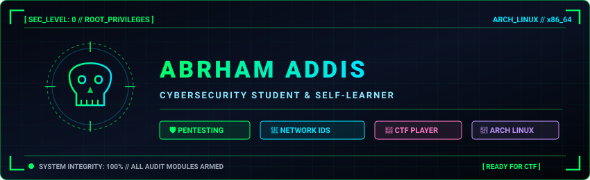

<div align="center">



<br/>

[](https://git.io/typing-svg)

</div>

---

### 💻 `$ whoami --verbose`

```bash
        .---.
       /     \
      | () () |       NAME     : Abrham
       \  _  /        STATUS   : Cybersecurity Student & Self-Learner 🛡️
        /   \         FOCUS    : Offensive Security, Defensive Monitoring & Network IDS
       /|   |\        OS       : Arch Linux x86_64 🐧
      (_|   |_)       PROJECT  : ANDS — Anomaly-based Network Detection System
        "---"         MOTTO    : Break it legally. Understand it. Secure it.
```

- 🛡️ **Cybersecurity Student & Self-Learner** — exploring offensive operations, threat hunting, and defensive telemetry
- 🔍 Building **ANDS** — an anomaly-based network intrusion detection system
- 🚩 Active **CTF Competitor** — solving challenges across web exploitation, cryptography, network analysis, and binary exploitation
- 🐧 Daily-driving **Arch Linux** with custom security auditing environments and automated tooling
- 📍 Based in **Addis Ababa, Ethiopia**
- 🌐 Portfolio: **[abrham-addis-portfolio.netlify.app](https://abrham-addis-portfolio.netlify.app/)**

---

## 🛠️ Security Arsenal & Tech Stack

<div align="center">

### ⚔️ Offensive Security & Pentesting


### 🛡️ Defensive Security, SIEM & Analysis


### 💻 Languages & Systems


### ⚙️ DevOps & Tooling


</div>

---

## 📊 GitHub Analytics

<div align="center">
  
  
</div>

<div align="center">
  <br/>
  
</div>

---

## 🎯 Cyber Routine & Operations

```python
class SecurityStudent:
    def __init__(self):
        self.name     = "Abrham"
        self.status   = "Cybersecurity Student & Self-Learner 🛡️"
        self.os       = "Arch Linux (btw)"
        self.focus    = ["Offensive Pentesting", "Threat Detection", "Network IDS"]
        self.project  = "ANDS — Anomaly-based Network Detection System"
        self.stack    = ["C++", "Python", "Bash", "Burp Suite", "Wireshark", "Metasploit"]

    def daily_routine(self):
        while True:
            self.study_network_protocols()
            self.hunt_vulnerabilities()
            self.solve_ctf_challenges()
            self.build_security_tools()
```

---

## 📬 Connect With Me

<div align="center">

[](https://abrham-addis-portfolio.netlify.app/)
[](mailto:addisabrham36@gmail.com)
[](https://github.com/addisabrham36-boop)

<br/>


</div>
